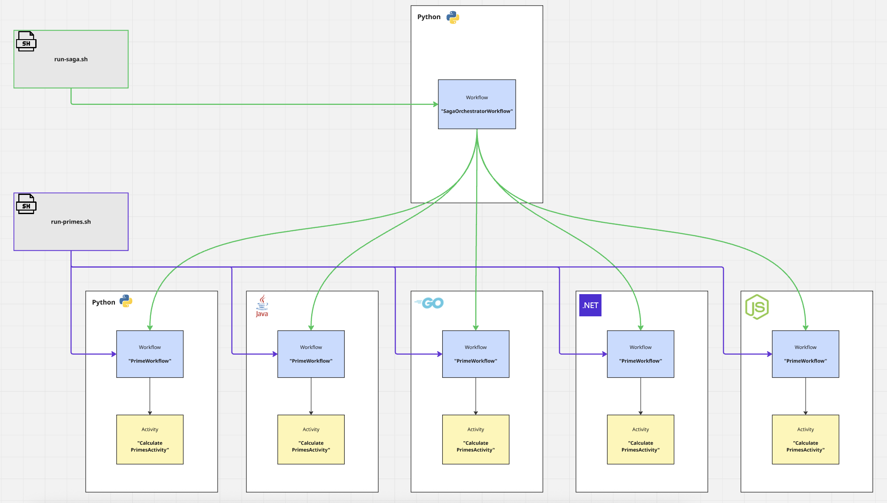

# Dapr Distributed Saga (Multi-Language Workflows Example)

This project demonstrates Dapr workflow capabilities across 5 languages (Go, Python, Java, .NET, and TypeScript). Each implementation calculates prime numbers using the Sieve of Eratosthenes algorithm, showcasing workflow orchestration patterns and activity execution. Additionally, it includes a saga orchestrator that demonstrates distributed saga patterns by coordinating all implementations in a single workflow.



## Architecture

The application consists of:

- **5 Language Implementations**: Go, Python, Java, .NET, and TypeScript applications each implementing the same prime number calculation workflow
- **Saga Orchestrator**: Python-based orchestrator that coordinates all 5 implementations in a distributed saga pattern
- **Dapr Sidecars**: One per application for workflow orchestration
- **Dapr Scheduler Cluster**: 3-node Dapr scheduler cluster for workflow scheduling
- **Dapr Placement Service**: Dapr placement service for actor distribution
- **PostgreSQL Database**: State store for Dapr workflow persistence
- **Diagrid Dashboard**: Visual workflow monitoring at http://localhost:8080

## Workflow Design

Each implementation follows the same pattern:

1. **Workflow**: `PrimeWorkflow` - Orchestrates the prime calculation
2. **Activity**: `CalculatePrimesActivity` - Executes the actual Sieve of Eratosthenes algorithm
3. **Input**: `{ "maxNumber": 100 }` - Calculate primes up to this number
4. **Output**: `{ "primes": [...], "count": 25, "maxNumber": 100, "calculationTimeMs": 5 }`

## Prerequisites

- Mac OS / ARM Architecture
- Docker and Docker Compose
- jq (for running the test script)
  - macOS: `brew install jq`
  - Linux: `sudo apt-get install jq`

## Quick Start (Mac OS ARM architecture only)

### 1. Build and Start All Services

```bash
docker-compose up -d --build
```

This will start:
- Go app on http://localhost:8081 (Dapr sidecar: 3500)
- Python app on http://localhost:8082 (Dapr sidecar: 3501)
- Java app on http://localhost:8083 (Dapr sidecar: 3502)
- .NET app on http://localhost:8084 (Dapr sidecar: 3503)
- TypeScript app on http://localhost:8086 (Dapr sidecar: 3505)
- Saga orchestrator on http://localhost:8085 (Dapr sidecar: 3504)
- Diagrid Dashboard on http://localhost:8080
- PostgreSQL on localhost:5432

### 2. Run the examples

#### Individual Workflows (run-primes.sh)

```bash
./run-primes.sh
```

This script will:
1. Schedule a workflow instance on each of the 5 implementations
2. Poll for completion
3. Display results including:
   - Number of primes found (25 primes up to 100)
   - Calculation time
   - First 10 primes: [2, 3, 5, 7, 11, 13, 17, 19, 23, 29]

You can also run specific implementations:
```bash
./run-primes.sh --go --python       # Run only Go and Python
./run-primes.sh --typescript        # Run only TypeScript
./run-primes.sh --java --dotnet     # Run only Java and .NET
```

#### Saga Orchestrator (run-saga.sh)

```bash
./run-saga.sh
```

This script demonstrates a saga orchestrator pattern that coordinates all 5 implementations:
1. Schedules a `SagaOrchestratorWorkflow` that calls all 5 apps
2. Aggregates results from all implementations
3. Displays:
   - Total executions and success rate
   - Total primes found across all apps (125 primes)
   - Average calculation time
   - Individual results for each language

You can specify a custom max number:
```bash
./run-saga.sh 500    # Calculate primes up to 500
```

**Output Structure:**
The saga returns a `results` object containing outcomes for each specified app:
```json
{
  "results": {
    "primes-go": { "primes": [...], "count": 25, "calculationTimeMs": 5 },
    "primes-python": { "primes": [...], "count": 25, "calculationTimeMs": 3 }
  },
  "totalExecutions": 2,
  "successfulExecutions": 2,
  "allCompleted": true,
  "totalCalculationTimeMs": 8,
  "averageCalculationTimeMs": 4.0,
  "totalPrimesFound": 25
}
```

### 3. View in Dashboard

Open http://localhost:8080 to see:
- All workflow instances
- Execution history
- State information
- Activity traces

### 4. Clean Up

```bash
docker-compose down -v
```

## Manual Testing

You can also schedule workflows manually using curl:

```bash
# Schedule workflow on Go implementation
curl -X POST "http://localhost:3500/v1.0/workflows/dapr/PrimeWorkflow/start?instanceID=test-go-1" \
  -H "Content-Type: application/json" \
  -d '{
    "maxNumber": 100
  }'

# Get workflow status
curl "http://localhost:3500/v1.0/workflows/dapr/test-go-1"
```

Replace `3500` with the appropriate Dapr sidecar port:
- Go: 3500
- Python: 3501
- Java: 3502
- .NET: 3503
- TypeScript: 3505

## Implementation Details


## Project Structure

```
.
├── go/                      # Go implementation
│   ├── main.go
│   ├── go.mod
│   └── Dockerfile
├── python/                  # Python implementation
│   ├── app.py
│   ├── requirements.txt
│   └── Dockerfile
├── java/                    # Java implementation
│   ├── pom.xml
│   ├── src/main/java/com/example/
│   └── Dockerfile
├── dotnet/                  # .NET implementation
│   ├── PrimeWorkflowApp.csproj
│   ├── Program.cs
│   ├── Models/
│   ├── Workflows/
│   ├── Activities/
│   └── Dockerfile
├── typescript/              # TypeScript implementation
│   ├── src/
│   │   ├── index.ts
│   │   ├── workflows/
│   │   ├── activities/
│   │   └── models/
│   ├── package.json
│   ├── tsconfig.json
│   └── Dockerfile
├── saga/                    # Saga orchestrator (Python)
│   ├── app.py
│   ├── requirements.txt
│   └── Dockerfile
├── components/              # Dapr components
│   └── statestore.yaml
├── docker-compose.yml       # Infrastructure orchestration
├── run-primes.sh            # Test script for individual workflows
└── run-saga.sh              # Test script for saga orchestrator
```

### Go Implementation

- Uses `github.com/dapr/go-sdk` v1.14.2
- Registry-based workflow registration
- Function-based workflow and activity definitions
- HTTP server on port 8080 for health checks

### Python Implementation

- Uses `dapr-ext-workflow` v1.17.4
- Decorator-based workflow registration (`@wfr.workflow`, `@wfr.activity`)
- Generator pattern with `yield` for activity calls
- FastAPI for HTTP endpoints

### Java Implementation

- Uses `io.dapr:dapr-sdk-workflows` v1.17.2
- Spring Boot framework
- Class-based workflows extending `DaprWorkflow`
- Activity classes implementing `WorkflowActivity`

### Java Implementation

- Uses `io.dapr:dapr-sdk-workflows` v1.17.2
- Spring Boot framework
- Workflows implement `Workflow` interface with `create()` returning `WorkflowStub`
- Activities implement `WorkflowActivity` interface with `run()` method
- Simple registration with `WorkflowRuntimeBuilder`

### .NET Implementation

- Uses `Dapr.Workflow` v1.17.8
- ASP.NET Core with dependency injection
- Strongly-typed workflow and activity classes
- Record types for immutable data models

### TypeScript Implementation

- Uses `@dapr/dapr` v3.17.0
- Node.js with Express framework
- Async generator function pattern for workflows
- Full TypeScript type safety with interfaces
- Workflow defined as `async function*` with `yield` for activity calls

## Algorithm: Sieve of Eratosthenes

All implementations use the same efficient algorithm for finding prime numbers:

1. Create a boolean array from 0 to maxNumber
2. Mark 0 and 1 as non-prime
3. For each number i from 2 to √maxNumber:
   - If i is prime, mark all multiples of i (starting from i²) as non-prime
4. Collect all numbers still marked as prime

For maxNumber=100, this finds 25 primes: [2, 3, 5, 7, 11, 13, 17, 19, 23, 29, 31, 37, 41, 43, 47, 53, 59, 61, 67, 71, 73, 79, 83, 89, 97]

## Port Reference

| Service | Application Port | Dapr HTTP Port | Dapr gRPC Port |
|---------|-----------------|----------------|----------------|
| Go | 8081 | 3500 | 50001 |
| Python | 8082 | 3501 | 50002 |
| Java | 8083 | 3502 | 50003 |
| .NET | 8084 | 3503 | 50004 |
| TypeScript | 8086 | 3505 | 50007 |
| Saga | 8085 | 3504 | 50006 |
| Dashboard | 8080 | - | - |
| PostgreSQL | 5432 | - | - |
| Placement | 50005 | - | - |

## Troubleshooting

### Check service health

```bash
docker-compose ps
```

All services should show "Up" status.

### View logs

```bash
# All services
docker-compose logs -f

# Specific service
docker-compose logs -f primes-go
docker-compose logs -f primes-python-dapr
```

### Verify database connection

```bash
docker-compose exec postgres-db psql -U postgres -d dapr -c "\dt"
```

### Restart a specific service

```bash
docker-compose restart primes-go primes-go-dapr
```

## Learn More

- [Dapr Workflows Documentation](https://docs.dapr.io/developing-applications/building-blocks/workflow/)
- [Dapr Go SDK](https://github.com/dapr/go-sdk)
- [Dapr Python SDK](https://github.com/dapr/python-sdk)
- [Dapr Java SDK](https://github.com/dapr/java-sdk)
- [Dapr .NET SDK](https://github.com/dapr/dotnet-sdk)
- [Diagrid Dashboard](https://github.com/diagridio/diagrid-dashboard)
